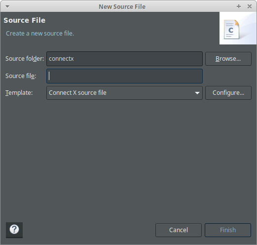
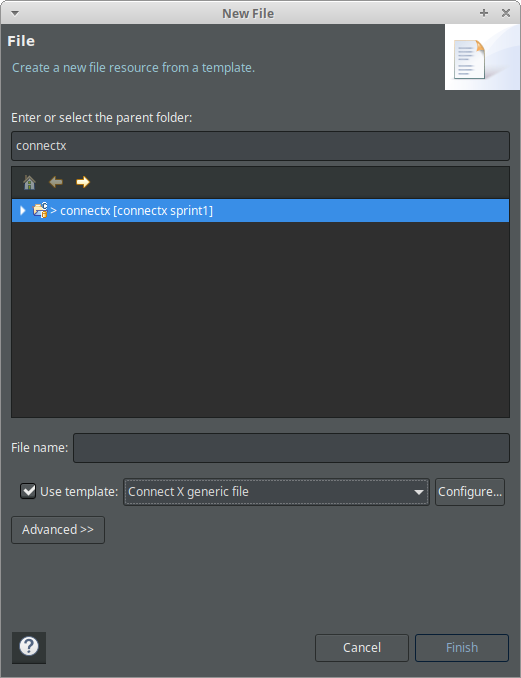

# Release 1 (December 1st, 2019)

## Sprint objectives

In this sprint, there are two main objectives:

1. Define a way to generate comments automatically in Eclipse CDT. This has been a major issue in the last project since lots of time was wasted of reviewing comments for form, misspelled tags, etc.

2. Create the `cxmodel` library, which will eventually hold all the code for the Connect X model.

## Define auto generated comments in Eclipse CDT

### C++ Editor templates

Eclipse CDT has tools that enable developers to create code snippets to be automatically inserted by the IDE when special actions are performed, such as creating a file, for instance. The Java side of Eclipse is very comment friendly and one can truly rely on the tool to generate well formatted, generic, Javadoc compliant comments automatically. In CDT, I found there were a series of limitations that made this vision impossible with Doxygen.

Still, some limited snippets were created and even if they do not go all the way, a good deal (especially on form) is done automatically. In the C/C++ editor, you can press `Ctrl+Space` to enable auto completion and type any of the following:

- `class`: A class template;
- `struct`: A C++ struct template;
- `enum`: A typed enumeration (C++11) template;
- `method`: A method template;
- `free_function`: A free function template;
- `macro`: A `#define` C-style macro template.

and hit `Enter` to auto generate the corresponding code snippet (with comments included at the right place and with the right form).

### New file templates

Furthermore, on new file creation, one can choose the _Connect X source/header file_ (new C++ Source or Header File)

as well as the _Connect X generic file_ (new File From Template)

to create a file with the right licensing and Doxygen information already included.

### Template configuration files

These templates are kept in two files and can be imported in any Eclipse CDT setup:

- __C++ Editor templates__: kept under `tools/eclipse/cxcodetemplates.xml`. They can be imported by selecting, in Eclipse, `Window->Preferences->C/C++->Code Style->Code Templates`.
- __New file templates__: kept under `tools/eclipse/cxeditortemplates.xml`. They can be imported by selecting, in Eclipse, `Window->Preferences->C/C++->Editor->Templates`.

## Create library for `cxmodel`

The static library `cxmodel` has been created. It can be built in two ways

1. __By building the whole project__: call `make` from the top level project directory.
2. __By building only the library__: call `make cxmodel/libcxmodel.a` from the top level project directory.

Libraries, object files and executable are created in the source directories. You can clean using `make clean` from the top level project directory. `make clean cxmodel/libcxmodel.a` will clean the library only. Note that a unit test executable is also available. To build it, you can build the whole project (see above) or call `make cxmodel/test/cxmodeltests`.

## Next sprint

In the next iteration:

1. The standard command line arguments `--version` and `--help` will be added to the executable.
2. An analysis of the `cxmodel` library will be done to maximize the chances of building a nice architecture for the project.

